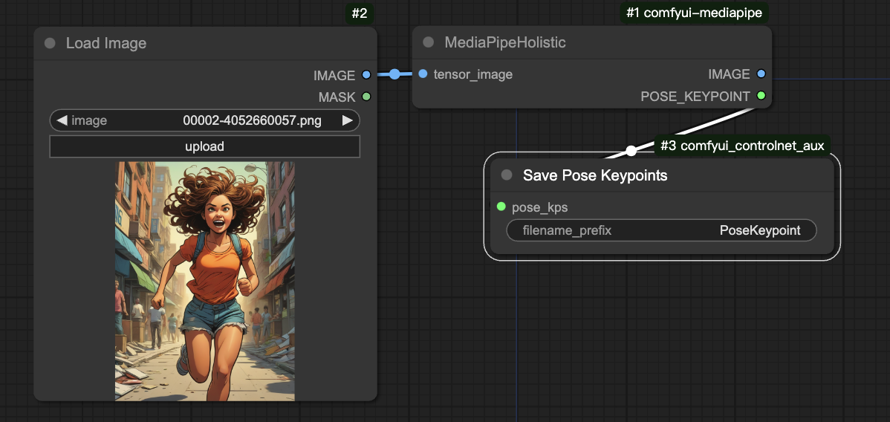

# Comfyui-mediapipe
基于 [mediapipe](https://github.com/google-ai-edge/mediapipe) 的 ComfyUI 自定义节点，获取图片的3d坐标信息；保存3d坐标信息需要依赖节点(https://github.com/solution9th/comfyui_controlnet_aux.git)


## 安装

Clone 仓库到 ComfyUI/custom_nodes

```bash
cd Your-ComfyUI/custom_nodes
git clone git@bitbucket.org:globalsphere/comfyui-mediapipe.git
```

安装依赖

```bash
cd Your-ComfyUI/custom_nodes/comfyui-mediapipe
pip install -r requirements.txt
```

## 获取图片坐标数据结构
```
{
    'pose_world_landmarks': [],
    'pose_landmarks': [],
    'left_hand_landmarks': [],
    'right_hand_landmarks': [],
    'face_landmarks': []
}